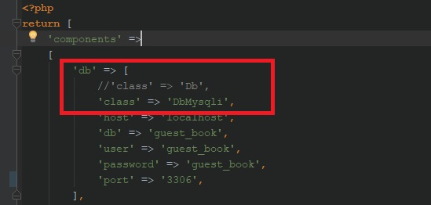

# Гостевая книга
Книга использует концепцию MVC, поддерживает PDO, MySQLi и CSV для работы с данными.
Приложение разработано для  использования в качестве самостоятельного инструмента  для  общения  пользователей на сайте, а также для внедрения в качестве вспомогательного инструмента в функционал интернет-магазина, платформы для дистанционного образования, форумов  и т.д., везде, где предусмотрено общение двух и более пользователей в режиме диалога.

## Возможности
+ Добавление сообщения в ленту с указанием имени и текста сообщения;
+ Отображение ленты сообщений в обратном хронологическом порядке  по дате добавления от новых к старым;
+ Добавление сообщения в ленту с указанием имени и текста сообщения;
+ Добавление комментария на сообщение;
+ Редактирование выбранного сообщения в ленте;
+ Удаление выбранного сообщения и комментария в ленте.

## Требования к ПО
+ PHP 5.6+
+ MySQL

## Установка
+ Конфигурация. 
Настройте параметры согласно сл.пункту _Настройка параметров подключения в базе данных_.

+ Изменения класса-наследника у модели. Для работы с классом PDO или классом MySQLi необходимо переключить класс-наследник в моделях:
 - classes/models/Comments и /classes/models/Messages.
 
 См.пример ниже:
 
 

## Настройка параметров подключения к базе данных
Настройки подключения к базе данных устанавливаются в файле classes/base/config/main.php.

Для работы с базой данных через расширение PDO необходимо раскомментировать класс Db в указанном файле, для работы с базой данных через расширение MySQLi используйте  класс DbMysqli (настроен по умолчанию).

См.пример ниже:

+ 'host' => 'localhost' - имя хоста, где размещена база данных, по умолчанию "localhost";
+ 'user' => 'guest_book' - имя пользователя базы данных, по умолчанию "guest_book";
+ password' => 'guest_book' - пароль пользователя, по умолчанию "guest_book";
+ 'db' => 'guest_book' - имя базы данных, по умолчанию "guest_book";
+ 'port' => '3306' - номер порта, по умолчанию "3306".

Измените настройки на свои.

### Работа с помощью файла .csv
В приложении предусмотрена работа с данными посредством файла формата .csv. 
Если у пользователя нет возможности настроить параметры подключения к базе данных, или база данных отсутствует, то функционал приложения предусматривает  выборку, добавление, обновление и удаление данных из файлов формата csv.
Класс ModelCsv находится в файле classes/base/models/ModelCsv.php.