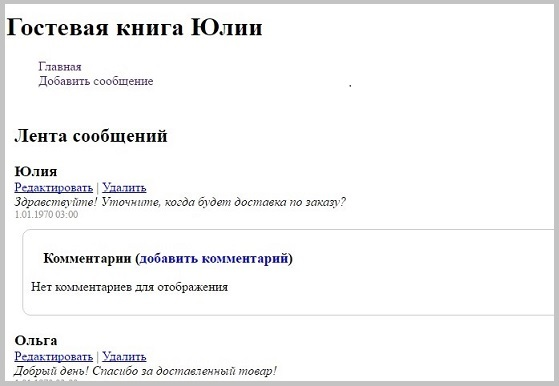

# Гостевая книга
Книга использует концепцию MVC, поддерживает PDO, MySQLi и CSV для работы с данными.

## Возможности
+ Добавление сообщения в ленту с указанием имени и текста сообщения;
+ Отображение ленты сообщений в обратном хронологическом порядке  по дате добавления от новых к старым;
+ Добавление сообщения в ленту с указанием имени и текста сообщения;
+ Добавление комментария на сообщение;
+ Редактирование выбранного сообщения в ленте;
+ Удаление выбранного сообщения и комментария в ленте.

## Требования к ПО
+ PHP 5.6+
+ MySQL

## Установка
+ Конфигурация. 
Настройте параметры согласно сл.пункту _Настройка параметров подключения в базе данных_.

+ Изменения класса-наследника у модели. Для работы с классом PDO или классом MySQLi необходимо переключить класс-наследник в моделях:
 - classes/models/Comments и /classes/models/Messages.
 См.пример ниже:
 

## Настройка параметров подключения к базе данных
Настройки подключения к базе данных устанавливаются в файле classes/base/config/main.php
Измените их на свои.

+ protected $host = 'localhost' - имя хоста, где размещена база данных, по умолчанию "localhost";
+ protected $user = 'guest_book' - имя пользователя базы данных, по умолчанию "guest_book";
+ protected $password = 'guest_book' - пароль пользователя, по умолчанию "guest_book";
+ protected $dbName = 'guest_book' - имя базы данных, по умолчанию "guest_book";
+ protected $port = 3306 - номер порта, по умолчанию "3306".